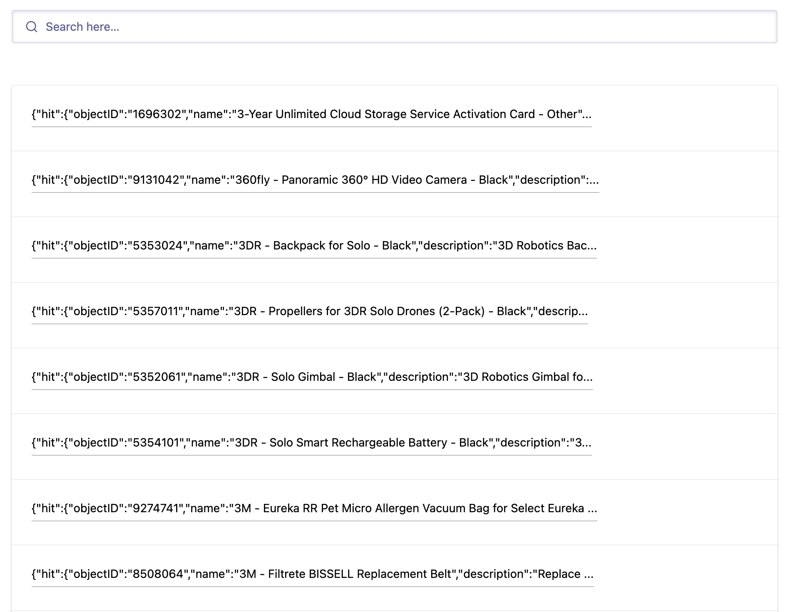
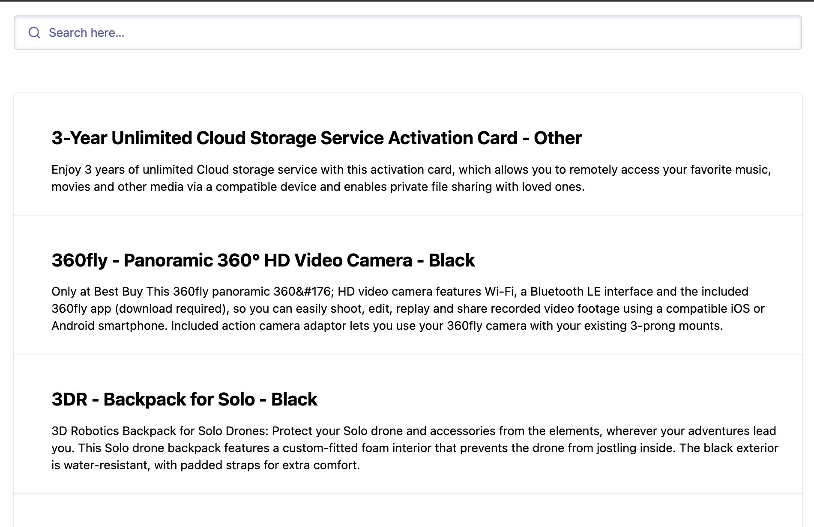
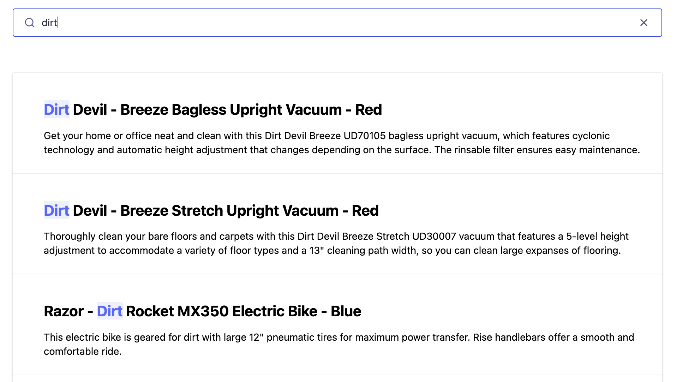
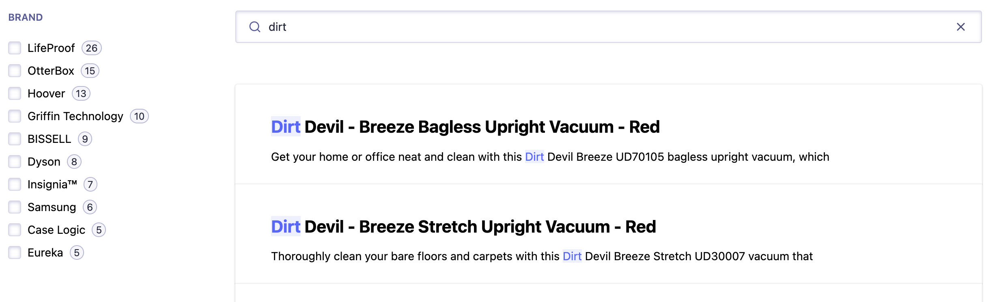
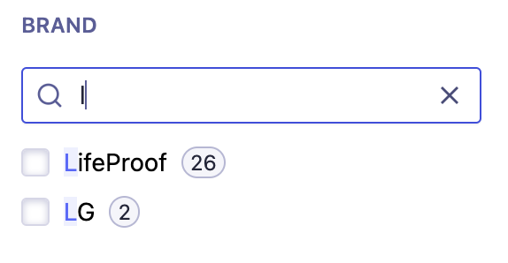
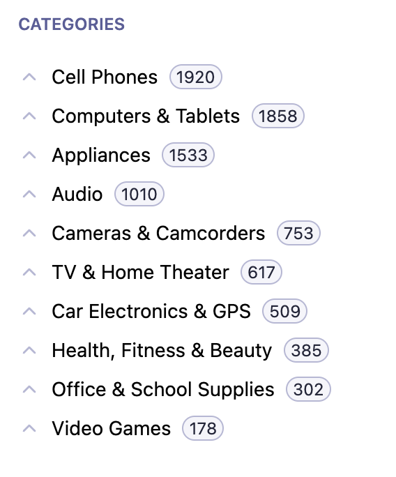
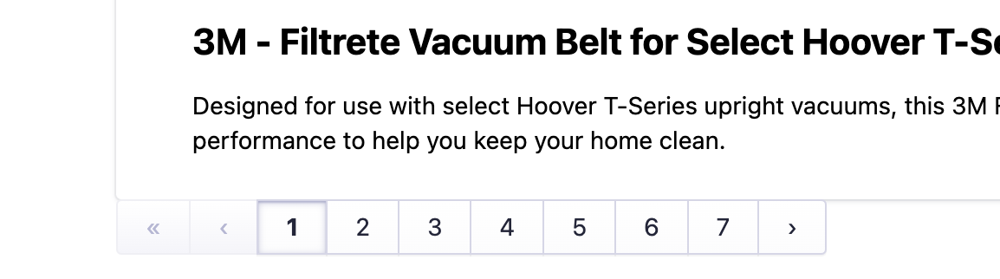
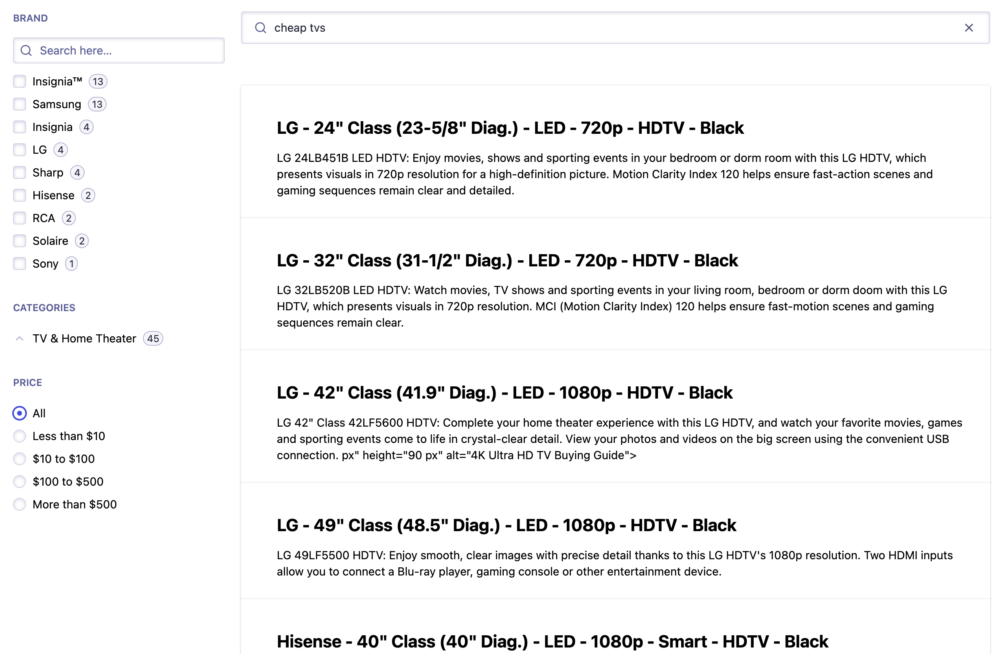
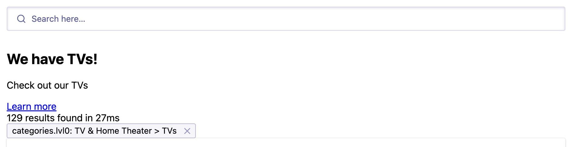

import { Callout, Tabs, Tab } from 'nextra-theme-docs'
import Setup from "./setup.mdx"

## Quick Start with Searchkit and React instantsearch

This guide will show you how to get started with Searchkit and React Instantsearch components.

<Callout type="info">
  If you use Next.js, checkout the <a href="/docs/tutorials/with-nextjs">Next.js guide</a> for a simpler setup.
</Callout>

## Download an Example Project

You can check out a Next.js project with Searchkit here:

```bash
curl https://codeload.github.com/searchkit/searchkit/tar.gz/main | \
tar -xz --strip=2 searchkit-main/examples/with-ui-nextjs-react
```

or view the example codebase on github [here](https://github.com/searchkit/searchkit/tree/main/examples/with-ui-nextjs-react)

## Code Sandbox Example

You can also check out the code sandbox example here:

<iframe src="https://codesandbox.io/embed/github/searchkit/searchkit/tree/main/examples/with-ui-nextjs-react?fontsize=14&hidenavigation=1&theme=dark&view=preview"
style={{
    width: "100%",
    height: "500px",
    marginTop: "20px",
    border: 0,
    overflow: "hidden",
    background: "rgb(21, 21, 21)",
  }}
     title="with-ui-nextjs-react"
     allow="geolocation; microphone; camera; midi; vr; accelerometer; gyroscope; payment; ambient-light-sensor; encrypted-media; usb"
     sandbox="allow-modals allow-forms allow-popups allow-scripts allow-same-origin"
   ></iframe>


<Setup />

### Installation
Installing both the API and instantsearch-client is easy. You can install them with npm or yarn.

For more details on installation and usage, see [Installation](/docs/installation).

<Tabs items={['npm', 'yarn']} storageKey="selected-pkg-manager">
  <Tab>
  ```bash
  npm install searchkit @searchkit/instantsearch-client react-instantsearch
  ```
  </Tab>
  <Tab>
 ```bash
  yarn add searchkit @searchkit/instantsearch-client react-instantsearch
  ```
  </Tab>
</Tabs>

### Adding Searchkit & Instantsearch to your React App

Below is a simple example of how to add Searchkit and Instantsearch to your React app.

```tsx
import React from "react";
import ReactDOM from "react-dom";
import Client from "@searchkit/instantsearch-client";
import Searchkit from "searchkit";
import { InstantSearch, SearchBox, Hits, RefinementList } from "react-instantsearch";

// Create a Searchkit client
// This is the configuration for Searchkit, specifying the fields to attributes used for search, facets, etc.
const sk = new Searchkit({
  connection: {
    host: "http://localhost:9200",
    // cloud_id: "my-cloud-id" // if using Elastic Cloud
    // if you're authenticating with username/password
    // https://www.searchkit.co/docs/guides/setup-elasticsearch#connecting-with-usernamepassword
    //auth: {
    //  username: "elastic",
    //  password: "changeme"
    //},
    // if you're authenticating with api key
    // https://www.searchkit.co/docs/guides/setup-elasticsearch#connecting-with-api-key
    // apiKey: "######"
  },
  search_settings: {
    search_attributes: ['name'],
    result_attributes: ['name', 'description']
  },
})

const searchClient = Client(sk);

const App = () => (
  <InstantSearch indexName="products" searchClient={searchClient}>
    <SearchBox />
    <Hits />
  </InstantSearch>
);

export default App;
```

### Adding Instantsearch theme Stylesheet

You can add the Instantsearch stylesheet via CDN file.

```html
  <link rel="stylesheet" href="https://cdn.jsdelivr.net/npm/instantsearch.css@7/themes/satellite-min.css">
```

If using next.js, you can do this in your app by importing it in your `pages/_app.tsx` file.

```tsx
import Head from "next/head";

function MyApp({ Component, pageProps }) {
  return (
    <>
      <Head>
        <link rel="stylesheet" href="https://cdn.jsdelivr.net/npm/instantsearch.css@7/themes/satellite-min.css" />
      </Head>
      <Component {...pageProps} />
    </>
  );
}
```

Then you should see this in your browser:



## Customise the results display

The default view of the `Hits` component is a list of the JSON objects returned by Elasticsearch. You can customise the display of the results by passing a `hitComponent` prop to the `Hits` component.

In order to return the name and description, we must specify the field attributes in the `search_settings` of Searchkit.

```tsx
  search_settings: {
    search_attributes: ['name'],
    result_attributes: ['name', 'description']
  }
```

Then we can define a custom hit React Component to return both name and description for each hit.

```tsx
// define a custom hit React Component
// returning both name and description for each hit
const HitView = ({ hit }) => (
  <div>
    <h3>{hit.name}</h3>
    <p>{hit.description}</p>
  </div>
);

// then in the App function
<Hits hitComponent={HitView} />
```



### Highlighting & Snippets

Instantsearch and Searchkit provide a way to highlight the search terms in the results. You can also specify the number of characters to display in the snippet.

For short text fields like name, you can use the `highlight` prop to highlight the search terms in the results. For longer text fields like description, you can use the `snippet` prop to display a snippet of the text.

First specify the `highlight_attributes` and `snippet_attributes` in the `search_settings` of Searchkit.

```tsx
  search_settings: {
      search_attributes: ['name'],
      result_attributes: ['name', 'description'],
      highlight_attributes: ['name'],
      snippet_attributes: ['description']
  }
```

Then you can use the `Highlight` and `Snippet` components to highlight and display snippets in the results.

```tsx
import { Snippet, Highlight } from 'react-instantsearch';

// define a custom hit React Component
// returning both name and description for each hit
const HitView = (props: any) => {
  return (
    <div>
      <h2>
        <Highlight attribute="name" hit={props.hit} />
      </h2>
      <Snippet attribute="description" hit={props.hit} />
    </div>
  );
};
```



## Adjust Query & Relevance

Next we want to customise how results are matched and ranked. This is done by specifying the `search_settings` in the Searchkit configuration.

### Specify search attributes and weights

We want to be able to search by name, description, categories & brand. We also want to give more weight to the name & brand field.

```tsx
  search_settings: {
      search_attributes: [
        { field: 'name', weight: 3 },
        { field: 'categories', weight: 2 },
        { field: 'brand', weight: 2 },
        'description'
      ],
      result_attributes: ['name', 'description', 'categories', 'brand'],
      highlight_attributes: ['name'],
      snippet_attributes: ['description']
  }
```

### Advanced: Customise Query DSL

Searchkit will use the fields specified in `search_attributes` and use [combined fields](https://www.elastic.co/guide/en/elasticsearch/reference/current/query-dsl-combined-fields-query.html) to search for the query terms.

You can also customise the query DSL by implementing the `getQuery` method. This is useful if you want to use a different query type like [multi_match](https://www.elastic.co/guide/en/elasticsearch/reference/current/query-dsl-multi-match-query.html).

```js
import Client from '@searchkit/instantsearch-client';

const searchClient = Client(sk, {
  getQuery: (query, search_attributes) => {
    return [
      {
        multi_match: {
          query: query,
          fields: search_attributes,
          type: "cross_fields",
        },
      },
    ];
  }
});
```

### Advanced: Semantic Search

You might want to transform the query terms into a vector embedding before searching. This is useful if you want to do semantic search.

Searchkit provides a way to customise the whole search DSL. This is useful if you want to do a vector search via KNN.

```tsx
import Client from '@searchkit/instantsearch-client';

const searchClient = Client(sk, {
  getKnnQuery(query, search_attributes, config) {
    return {
      field: 'dense-vector-field',
      k: 10,
      num_candidates: 100,
      // supported in Elasticsearch 8.7+
      query_vector_builder: {
        text_embedding: {
          model_id: 'cookie_model',
          model_text: query
        }
      }
    }
  }
});
```

### Advanced: Searching Nested Fields

Currently Searchkit does not support nested fields as searchable attributes as a configuration, however you can use the `getQuery` method to customise the query DSL to search nested fields.

```tsx
import Client from '@searchkit/instantsearch-client';

const searchClient = Client(sk, {
  getQuery: (query) => {
    return {
      bool: {
        must: [
          {
            nested: {
              path: "user",
              query: {
                combined_fields: {
                  query: query,
                  fields: ["user.first"]
                }
              }
            }
          }
        ]
      }
    };
  }
});
```

## Refinements

Refinements (also known as facets) allow your users to narrow down their search results. You can easily add refinements with the many refinement components provided by Instantsearch.

In this example we are going to add a `brand` refinement facet. We will also add a `categories` refinement facet to show how to use a hierarchical facet.

## Brand Refinement Facet

First you must add the `brand` field to the `search_settings` in Searchkit.

<Callout type="info">
  The field must be a keyword field in Elasticsearch. By default, Elasticsearch will create a keyword field for each text field. To use the keyword field, you must specify the field name with the `.keyword` suffix.
</Callout>

```tsx
  search_settings: {
      search_attributes: [
        { field: 'name', weight: 3 },
        { field: 'categories', weight: 2 },
        { field: 'brand', weight: 2 },
        'description'
      ],
      result_attributes: ['name', 'description', 'categories', 'brand'],
      highlight_attributes: ['name'],
      snippet_attributes: ['description'],
      facet_attributes: [
        { attribute: 'brand', field: 'brand.keyword', type: "string" }
      ]
  }
```

Then you can add the `RefinementList` component to the `App` function.

```tsx

import { InstantSearch, SearchBox, Hits, RefinementList } from 'react-instantsearch';

const App = () => (
  <InstantSearch indexName="products" searchClient={searchClient}>
    <SearchBox />
    <RefinementList attribute="brand" />
    <Hits />
  </InstantSearch>
);
```



### Show more
The `RefinementList` will display the top 10 brands by default. You can use the `showMore` prop to show more brands.

```tsx
<RefinementList attribute="brand" showMore />
```


### Searchable
The `RefinementList` will also allow you to search for a specific brand.

```tsx
<RefinementList attribute="brand" searchable />
```



There are many more options available for refinements as well as other components for different types of refinements.

### Hierarchical Facet

One of the most common use cases for refinements is to filter by categories. You can use a hierarchical facet to display the categories in a tree structure.

First you must add the `categories` levels to the `search_settings` in Searchkit.

```tsx
  search_settings: {
      search_attributes: [
        { field: 'name', weight: 3 },
        { field: 'categories', weight: 2 },
        { field: 'brand', weight: 2 },
        'description'
      ],
      result_attributes: ['name', 'description', 'categories', 'brand'],
      highlight_attributes: ['name'],
      snippet_attributes: ['description'],
      facet_attributes: [
        { attribute: 'brand', field: 'brand.keyword', type: "string" },
        { attribute: 'categories_lvl0', field: 'hierarchicalCategories.lvl0.keyword', type: "string" },
        { attribute: 'categories_lvl1', field: 'hierarchicalCategories.lvl1.keyword', type: "string" },
        { attribute: 'categories_lvl2', field: 'hierarchicalCategories.lvl2.keyword', type: "string" }
      ]
  }
```

Then you can add the `HierarchicalMenu` component to the `App` function.

```tsx

import { InstantSearch, SearchBox, Hits, RefinementList, HierarchicalMenu } from 'react-instantsearch';

const App = () => (
  <InstantSearch indexName="products" searchClient={searchClient}>
    <SearchBox />
    <RefinementList attribute="brand" />
    <HierarchicalMenu
      attributes={[
        'hierarchicalCategories.lvl0',
        'hierarchicalCategories.lvl1',
        'hierarchicalCategories.lvl2',
      ]}
    />
    <Hits />
  </InstantSearch>
);
```

and then you should see the categories in a tree structure.



### Other Refinement Components

There are many other refinement components available in Instantsearch. You can find the full list of refinement components [here](/docs/components/refinements/refinement-list).

### Nested Fields support

Searchkit supports nested fields for refinements. Read more about nested fields [here](/docs/guides/facets/string-based-facets#nested-fields-support).

```tsx
{
  facet_attributes: [
    {
      attribute: 'marketplace.supplier',
      field: 'supplier.keyword',
      type: 'string',
      nestedPath: 'marketplace'
    }
  ]
}
```

### Numeric Based Refinement

Numeric based refinements are useful if you want to filter by price or other numeric values.

In this example we are going to add a numeric refinement for price.

First you must add the `price` field to the `search_settings` in Searchkit.

```tsx
  search_settings: {
    search_attributes: [
      { field: 'name', weight: 3 },
      { field: 'categories', weight: 2 },
      { field: 'brand', weight: 2 },
      'description'
    ],
    result_attributes: ['name', 'description', 'categories', 'brand'],
    highlight_attributes: ['name'],
    snippet_attributes: ['description'],
    facet_attributes: [
      { attribute: 'brand', field: 'brand.keyword', type: "string" },
      { attribute: 'categories_lvl0', field: 'hierarchicalCategories.lvl0.keyword', type: "string" },
      { attribute: 'categories_lvl1', field: 'hierarchicalCategories.lvl1.keyword', type: "string" },
      { attribute: 'categories_lvl2', field: 'hierarchicalCategories.lvl2.keyword', type: "string" },
      { attribute: 'price', field: 'price', type: "numeric" }
    ]
  }
```

Then you can add the `RangeInput` component to the `App` function.

```tsx

import { InstantSearch, SearchBox, Hits, RefinementList, HierarchicalMenu, RangeInput } from 'react-instantsearch';

const App = () => (
  <InstantSearch indexName="products" searchClient={searchClient}>
    <SearchBox />
    <RefinementList attribute="brand" />
    <HierarchicalMenu
      attributes={[
        'hierarchicalCategories.lvl0',
        'hierarchicalCategories.lvl1',
        'hierarchicalCategories.lvl2',
      ]}
    />
    <RangeInput attribute="price" />
    <Hits />
  </InstantSearch>
);
```

Now you should see a range input to adjust from and to pricing.

## Filter Attributes

Filter attributes are attributes that are used to filter the search results.

Filters are useful for fields that you do not want facets for, but you want to be able to filter by.

An example of this could be a date field.

TODO: Add example

## Pagination & Size

Next we are going to add pagination and size to the search results.

### Pagination

Pagination is useful if you want to show more pages for your results.

```tsx

import { InstantSearch, SearchBox, Hits, RefinementList, HierarchicalMenu, NumericMenu, Pagination } from 'react-instantsearch';

const App = () => (
  <InstantSearch indexName="products" searchClient={searchClient}>
    <SearchBox />
    <RefinementList attribute="brand" />
    <HierarchicalMenu
      attributes={[
        'hierarchicalCategories.lvl0',
        'hierarchicalCategories.lvl1',
        'hierarchicalCategories.lvl2',
      ]}
    />
    <NumericMenu attribute="price" items={[
      { label: 'All' },
      { label: 'Less than $10', end: 10 },
      { label: '$10 to $100', start: 10, end: 100 },
      { label: '$100 to $500', start: 100, end: 500 },
      { label: 'More than $500', start: 500 },
    ]} />
    <Hits />
    <Pagination />
  </InstantSearch>
);
```

### Size

You can adjust the number of results per page by adding the `Configure` component.

```tsx

import { InstantSearch, SearchBox, Hits, RefinementList, HierarchicalMenu, NumericMenu, Pagination, Configure } from 'react-instantsearch';

const App = () => (
  <InstantSearch indexName="products" searchClient={searchClient}>
    <Configure hitsPerPage={15} />
    <SearchBox />
    <RefinementList attribute="brand" />
    <HierarchicalMenu
      attributes={[
        'hierarchicalCategories.lvl0',
        'hierarchicalCategories.lvl1',
        'hierarchicalCategories.lvl2',
      ]}
    />
    <NumericMenu attribute="price" items={[
      { label: 'All' },
      { label: 'Less than $10', end: 10 },
      { label: '$10 to $100', start: 10, end: 100 },
      { label: '$100 to $500', start: 100, end: 500 },
      { label: 'More than $500', start: 500 },
    ]} />
    <Configure hitsPerPage={15} />
    <Hits />
    <Pagination />
  </InstantSearch>
);
```



## Sorting

Sorting is useful if you want to sort the results by a specific field.

TODO: Add example

## Query Rules

Query rules can help you customize the search results based on the user's query.

To illustrate their use, we will add a query rule that will boost the results for the query "cheap tvs".

### Setting up the query rule

Add a query rule to Searchkit `search_settings`

When the customer types in "cheap tvs", the query rule will be applied and the results will be filtered to televisions with a price range between 0 to 500, and the results for the brand LG will be boosted.

```tsx
  search_settings: {
    // ... other settings
    query_rules: [
      {
        id: 'cheap-tvs', // needs to be unique
        conditions: [
          [
            { // true when the query is "cheap tvs"
              context: 'query',
              value: 'cheap tvs',
              match_type: 'exact'
            }
          ]
        ],
        actions: [
          { // update the query to be empty
            action: 'QueryRewrite',
            query: ''
          },
          { // filter the results to be televisions and price range between 0 to 500
            action: 'QueryFilter',
            query: 'price:[0 TO 500] AND categories:TVs'
          },
          { // boost the results for the brand LG
            action: 'QueryBoost',
            query: 'brand:LG',
            weight: 10
          }
        ]
      }
    ]
  }
```



### Show facets depending on query or filters

Another example of query rules is to show different facets depending on the query or filters.

When a customer selects the TV category, we will display the brand facet.

```tsx
  search_settings: {
    // ... other settings
    query_rules: [
      { // this rule is to control which facets are displayed and in which order
        id: 'default-state',
        conditions: [[]],
        actions: [
          {
            action: 'RenderFacetsOrder',
            facetAttributesOrder: [
              'categories.lvl0',
              'categories.lvl1',
              'categories.lvl2',
              'price'
            ]
          }
        ]
      },
      {
        id: 'tv-categories',
        conditions: [
          [
            {
              context: 'filterPresent',
              values: [
                {
                  attribute: 'categories.lvl1',
                  value: 'TV & Home Theater > TVs'
                }
              ]
            }
          ]
        ],
        actions: [
          {
            action: 'RenderFacetsOrder',
            facetAttributesOrder: [
              'categories.lvl0',
              'categories.lvl1',
              'categories.lvl2',
              'brand', // show the brand facet
              'price'
            ]
          }
        ]
      }
    ]
  }
```

On the frontend, you need to use the `DynamicWidgets` component to control which facets are displayed, based on the query rules.

```tsx
import { DynamicWidgets } from 'react-instantsearch'

// in the app component

<DynamicWidgets>
  <RefinementList attribute="brand" />
  <HierarchicalMenu
    attributes={[
      'hierarchicalCategories.lvl0',
      'hierarchicalCategories.lvl1',
      'hierarchicalCategories.lvl2',
    ]}
  />
  <NumericMenu attribute="price" items={[
    { label: 'All' },
    { label: 'Less than $10', end: 10 },
    { label: '$10 to $100', start: 10, end: 100 },
    { label: '$100 to $500', start: 100, end: 500 },
    { label: 'More than $500', start: 500 },
  ]} />
</DynamicWidgets>

```

### Display Banner based on query

Another example of query rules is to display a banner based on the query.

This could be used to display a banner with more TV info when the customer selects the TV category.

```tsx
  search_settings: {
    // ... other settings
    query_rules: [
      {
        id: 'tv-categories',
        conditions: [
          [
            {
              context: 'filterPresent',
              values: [
                {
                  attribute: 'categories.lvl1',
                  value: 'TV & Home Theater > TVs'
                }
              ]
            }
          ]
        ],
        actions: [
          {
            action: 'RenderUserData',
            userData: JSON.stringify({
              title: 'We have TVs!',
              body: 'Check out our TVs',
              url: 'https://www.samsung.com'
            })
          }
        ]
      }
    ]
  }
```

On the frontend, you use the `useQueryRules` hook to display the banner.

```tsx
import { useQueryRules } from 'react-instantsearch'

const QueryRulesBanner = () => {
  const {items} = useQueryRules({})
  if (items.length === 0) {
    return null
  }

  return (
    <div className="query-rules">
      {items.map((item) => (
        <div key={item.objectID} className="query-rules__item">
          <a href={item.url}>
            <b className="query-rules__item-title">{item.title}</b>
            <span className="query-rules__item-description">{item.body}</span>
          </a>
        </div>
      ))}
    </div>
  )
}

const App = () => (
  <InstantSearch indexName="products" searchClient={searchClient}>
    {/* ... other components */}
    <QueryRulesBanner />
  </InstantSearch>
);
```



Now the banner will be displayed when the customer selects the TV category.

### Query Rules Next Steps

Query rules are super amazing! Read more about them in [Query Rules](/docs/query-rules).

#### More Conditions not covered in this guide
* [Context](/docs/query-rules/conditions/context) - Activate certain actions with context based on the user (segments, location, a/b experiments, etc)

#### More Actions not covered in this guide
* [Pin Results](/docs/query-rules/actions/pin-result) - Pin certain results to the top, regardless of the ranking. This is useful if you want to show a specific product in the search results.

Follow the [query rules guide](/docs/query-rules) to add query rules to your search.

## Other Search Features

We covered the most common search features, but there are many more features that you can add to your search.

* [Geo Search](/docs/components/geo-search/geo-search)

## Next Steps

Now you have built your Search UI, before you go to production, you should proxy your Elasticsearch cluster to make it secure, rather than exposing it to the public. Searchkit makes this simple. You can read more about it in [Proxying Elasticsearch](/docs/proxy-elasticsearch/why).

