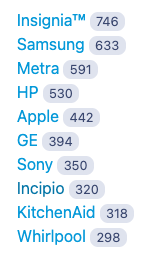
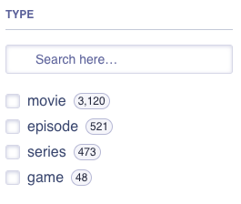

## Facet Examples

Searchkit API supports a number of different instantsearch facet components. The following examples show what components are supported and how to add them to your search application.

Below focuses on the React InstantSearch library, but the same components are available for other instantsearch frameworks.

Theres a lot more facet components supported by Algolia and if you want to see one that isnt listed here, please let us know via github issues!

## Data Requirements

Depending on the field value, you may need to add a custom mapping to your index. For example, if you have a field that contains text, you will need to add a `keyword` mapping to your index to ensure that Elasticsearch can create facet options.

```json
{
  "properties": {
    "brand": {
      "type": "text",
      "fields": {
        "keyword": {
          "type": "keyword"
        }
      }
    }
  }
}
```

See [setting up elasticsearch](/docs/guides/setting-up-elasticsearch) for more information.

## Setting up the API

To use a field as a facet, you must add it to the `facet_attributes` array in the configuration. For example, if you have a field called `brand`, you would add it to the configuration like this:

```json
{
  "facet_attributes": ["brand"]
}
```

If you have a field that contains a keyword subfield, you can use that field as a facet. For example, if you have a field called `brand` with a `keyword` subfield, you would add it to the configuration like this:

```json
{
  "facet_attributes": [{ "attribute": "brand", "field": "brand.keyword", "type": "string" }]
}
```

If you have a field that is a numerical value and want to use the numerical type facets, you need to configure it as a numerical type. For example, if you have a field called `price`, you would add it to the configuration like this:

```json
{
  "facet_attributes": [{ "attribute": "imdbrating", "type": "numeric", "field": "imdbrating" }]
}
```

### Nested Fields Support

Searchkit API supports nested fields. If you have a document like this:

```json
PUT my-index-000001
{
  "mappings": {
    "properties": {
      "user": {
        "type": "nested" 
      }
    }
  }
}

PUT my-index-000001/_doc/1
{
  "user" : [
    {
      "first" : "John",
      "last" :  "Smith"
    },
    {
      "first" : "Alice",
      "last" :  "White"
    }
  ]
}
```

Then you can add the nested field to the facet attributes like this:

```json
{
  "facet_attributes": [{
    "attribute": "user.first",
    "field": "first.keyword", // make sure to use the keyword subfield
    "type": "string",
    "nestedPath": "user"
  }]
}
```

and then you can use the facet in your search application like this:

```jsx filename="pages/search.tsx"
import { RefinementList } from "react-instantsearch-dom";

<RefinementList attribute="user.first" />;
```

an example of this working in [codesandbox](https://codesandbox.io/s/beta-example-nested-field-support-for-facet-and-filters-n3gp11?file=/pages/api/search.ts:475-606)

## Components

### Menu Widget

**Text based & requires a keyword type field**

The menu component displays a list of facet values. When a value is selected, only results matching that value are displayed. Only one value can be selected at a time.



#### Usage

```jsx filename="pages/search.tsx"
import { Menu } from "react-instantsearch-dom";

<Menu attribute="brand" />;
```

### RefinementList Widget

**Text based & requires a keyword type field**

The RefinementList component displays a list of facet values. When a value is selected, only results matching that value are displayed. More than one value can be selected at a time.



#### Usage

```jsx filename="pages/search.tsx"
import { RefinementList } from "react-instantsearch-dom";

<RefinementList attribute="brand" />;
```

### Rating Widget

**Numerical based & requires a numeric type field**

The Rating component displays a list of facet values. When a value is selected, only results matching that value are displayed. More than one value can be selected at a time.


#### Usage

```jsx filename="pages/search.tsx"
import { RatingMenu } from "react-instantsearch-dom";

<RatingMenu attribute="imdbrating" />;
```

### Range Input Widget

**Numerical based & requires a numeric type field**


#### Usage

```jsx filename="pages/search.tsx"
import { RangeInput } from "react-instantsearch-dom";

<RangeInput attribute="price" />;
```

### Numeric Menu Widget

**Numerical based & requires a numeric type field**


#### Usage

```jsx filename="pages/search.tsx"
import { NumericMenu } from "react-instantsearch-dom";

<NumericMenu
  attribute="price"
  items={[
    { start: 0, end: 10, label: "<$10" },
    { start: 10, end: 100, label: "$10-$100" },
    { start: 100, end: 500, label: "$100-$500" },
    { start: 500, label: ">$500" },
  ]}
/>;
```
