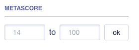
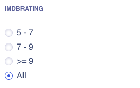
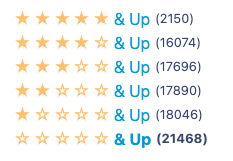

Searchkit API supports a number of different instantsearch facet components. The following examples show what components are supported and how to add them to your search application.

Below we will show how to setup a field in Elasticsearch to be used as a facet attribute. You will then be able to use the facet attribute with instantsearch components.

### Defining a facet attribute

By default, any numeric type field in Elasticsearch will be defined as a numeric type field. the numeric type field is can be used for aggregations.

Read more about Elasticsearch dynamic field mapping in the [Elasticsearch documentation](https://www.elastic.co/guide/en/elasticsearch/reference/master/dynamic-field-mapping.html).

The following document indexed in Elasticsearch:

```json
{
  "price": 90
}
```

Will result in the following mapping

```json
{
  "price": {
    "type": "long"
  }
}
```

The field can be used for facet attributes. In this case, the facet field should be `price`.

```json
{
  "facet_attributes": [{ "attribute": "price", "type": "numeric", "field": "price" }]
}
```

We need to define the field type as `numeric` as some of the instantsearch components require stats about the field. With the field type defined as `numeric`, we generate stats about the field for the instantsearch components.

Then you can use instantsearch components using the `price` facet attribute.

# Instantsearch Components

The following instantsearch components are supported:

## Range Input Widget



* React Storybook: (https://react-instantsearch.netlify.app/storybook/?path=/story/rangeinput--default)
* Instantsearch Storybook: (https://instantsearchjs.netlify.app/stories/js/?path=/story/refinements-rangeinput--default)

### Usage

```jsx filename="pages/search.tsx"
import { RangeInput } from "react-instantsearch-dom";

<RangeInput attribute="price" />;

```

## Numeric Menu Widget



* React Storybook: (https://react-instantsearch.netlify.app/storybook/?path=/story/numericmenu--default)
* Instantsearch Storybook: (https://instantsearchjs.netlify.app/stories/js/?path=/story/refinements-numericmenu--default)

### Usage

```jsx filename="pages/search.tsx"
import { NumericMenu } from "react-instantsearch-dom";

<NumericMenu
  attribute="price"
  items={[
    { start: 0, end: 10, label: "<$10" },
    { start: 10, end: 100, label: "$10-$100" },
    { start: 100, end: 500, label: "$100-$500" },
    { start: 500, label: ">$500" },
  ]}
/>;
```

## Rating Widget

The Rating component displays a list of facet values. When a value is selected, only results matching that value are displayed. More than one value can be selected at a time.



* React Storybook: (https://react-instantsearch.netlify.app/storybook/?path=/story/ratingmenu--default)
* Instantsearch Storybook: (https://instantsearchjs.netlify.app/stories/js/?path=/story/refinements-ratingmenu--default)

### Usage

```jsx filename="pages/search.tsx"
import { RatingMenu } from "react-instantsearch-dom";

<RatingMenu attribute="imdbrating" />;
```

## Range Slider Widget

The RangeSlider component displays a range slider. When a value is selected, only results matching that value are displayed.

* React Storybook: (https://react-instantsearch.netlify.app/storybook/?path=/story/rangeslider--default)
* Instantsearch Storybook: (https://instantsearchjs.netlify.app/stories/js/?path=/story/refinements-rangeslider--default)

### Usage

```jsx filename="pages/search.tsx"
import { Range } from "react-instantsearch-dom";

<Range attribute="price" />
```