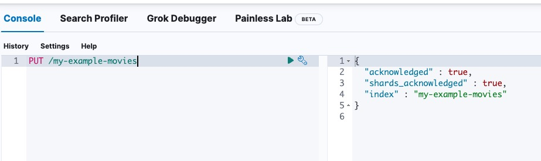
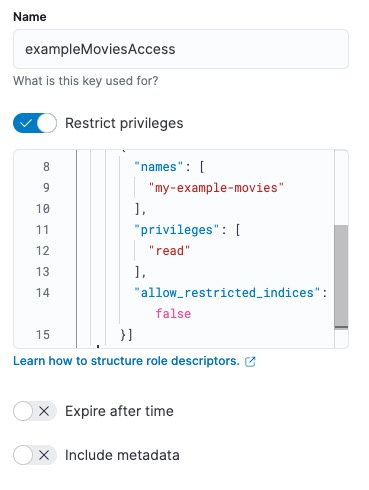
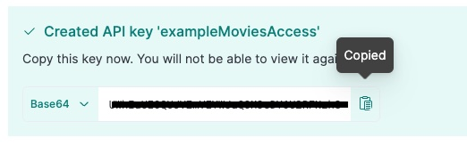
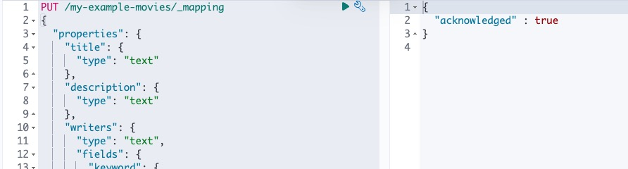

## Setting up Elasticsearch

This tutorial will guide you through the process of setting up Elasticsearch, to be used with Instantsearch and ISES. We will be using a sample movie data-set of around 1000 movies.

Within this tutorial, we assume that you have Node.js installed on your machine.

### Step 1: Setup Elasticsearch

First we need to setup Elasticsearch. The easiest way to do this is to create an Elasticsearch instance via [Elastic Cloud](https://cloud.elastic.co/registration).

#### Setting up an Index

We are going to issue commands via Kibana's dev tools console. You can alternatively use a REST client like Postman to achieve this.

First we need to create an index for our data. We can do this simply via the following request:

```sh
PUT /my-example-movies
```



#### Setting up a read-only API Key

Next we need to setup an API key to access the data from the index. We can do this via Kibana's Stack Management API Keys page ($YOUR_KIBANA_ENDPOINT/app/management/security/api_keys). Note that security needs to be enabled for this option to be available.

Notice here we are only giving read privileges for this api key. You will need to setup an api key with write privileges to add and update data to the index.

```json
{
  "superuser": {
    "cluster": ["all"],
    "indices": [
      {
        "names": ["my-example-movies"],
        "privileges": ["read"],
        "allow_restricted_indices": false
      }
    ]
  }
}
```



Once saved, you are presented with the api-key. Copy this and keep it safe. We will need to use this further down in the tutorial.



### Step 2: Setup Movies Index

Next we need to setup the index fields, ready for us to ingest data.

The mapping for an index depends on the data you want to index and the features you want.

#### Examples

##### Searchable Fields

We want to be able to search on title. We need only one field of type text.

```json
{
  "properties": {
    "title": {
      "type": "text"
    }
  }
}
```

##### Searchable and Filterable Fields

We want to be able to search and be facetable for the writers field. We need two fields of different types: keyword and text.

```json
{
  "properties": {
    "writers": {
      "type": "text",
      "fields": {
        "keyword": {
          "type": "keyword"
        }
      }
    }
  }
}
```

##### Numerical fields for Facets

We want to be able to facet and filter on the year field. We need a field of type integer.
Can be other numerical types, see [Numerical type documentation](https://www.elastic.co/guide/en/elasticsearch/reference/current/number.html)

```json
{
  "properties": {
    "year": {
      "type": "integer" // can also be other numerical types like long, short, byte, double, float
    }
  }
}
```

##### Date fields for Facets

We want to be able to facet and filter on the date field. We need a field of type date.

```json
{
  "properties": {
    "released": {
      "type": "date"
    }
  }
}
```

For our movie data-set, we will be using the following fields:

- **title** (searchable)
- **plot** (searchable)
- **genre** (searchable, facetable)
- **actors** (searchable, facetable)
- **directors** (searchable, facetable)
- **released** (filterable)
- **imdbRating** (filterable)
- **url**

The mapping file will be as follows, and we'll once again use Kibana's dev tools console to update the mapping file for our index.

```json
PUT /my-example-movies/_mapping
{
  "properties": {
    "title": {
      "type": "text"
    },
    "plot": {
      "type": "text"
    },
    "genre": {
      "type": "text",
      "fields": {
        "keyword": {
          "type": "keyword"
        }
      }
    },
    "actors": {
      "type": "text",
      "fields": {
        "keyword": {
          "type": "keyword"
        }
      }
    },
    "directors": {
      "type": "text",
      "fields": {
        "keyword": {
          "type": "keyword"
        }
      }
    },
    "released": {
      "type": "date"
    },
    "imdbRating": {
      "type": "float"
    },
    "url": {
      "type": "keyword"
    }
  }
}
```



Elasticsearch will acknowledge the request in the response.

### Step 3: Index Movies Data

Now with our index and mapping file created, we are ready to index some data! We will use the bulk API to index our data.

We will use the following request. In this example we will be indexing the first movie in the data-set to verify that the data fields is being indexed correctly.

```json
PUT /my-example-movies/_bulk
{ "index": {}}
{"title": "The Godfather", "released": "1972-03-23T23:00:00.000Z","genre": ["Crime", "Drama"],"directors": ["Francis Ford Coppola"],"actors": ["Marlon Brando", "Al Pacino", "James Caan", "Richard S. Castellano"],"plot": "The aging patriarch of an organized crime dynasty transfers control of his clandestine empire to his reluctant son.","imdbRating": "9.2", "url": "https://www.imdb.com/title/tt0068646/"}
```

Your Elasticsearch instance is now ready to be used with ISES. See the [getting started](/docs/getting-started) guide for more information on how to use ISES.
