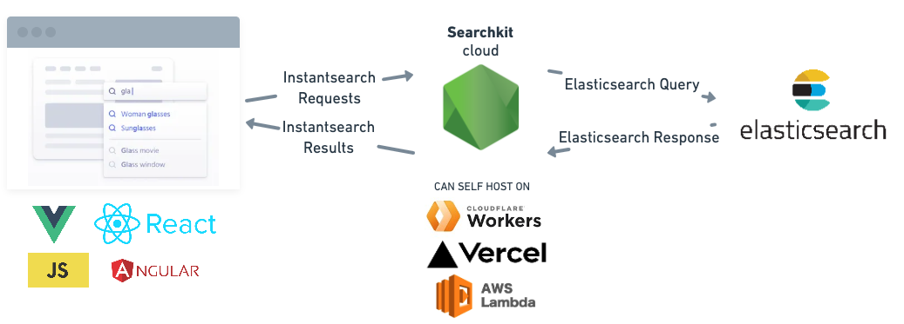

import Image from "next/image";
import { IntroButtons } from '../components/promo-page/IntroButtons';

<div className="pt-4 m-auto text-left">
  <h1 className="font-extrabold md:text-5xl mt-8 mb-4">Great search experiences, <br/>
  made easy.</h1>
  <div className="mb-10 max-w-lg">
    <p className="text-xl mb-1 text-gray-400 md:!text-xl">
      Searchkit is an open source library which helps you build a great search experience with Elasticsearch.
    </p>
    <p className="text-xl mb-1 text-gray-400 md:!text-xl">
      Works with React, Vue, Angular, and more.
    </p>
  </div>

  <IntroButtons />

</div>

## How it works
Searchkit integrates with your existing Elasticsearch cluster, and provides an API that allows you to build a search experience with Algolia Instantsearch.



Searchkit Cloud provides two public libraries:

- [cloud-sdk](./reference/api) Node API which transforms instantsearch requests into Elasticsearch queries
- [instantsearch-client](./reference/client) that integrates with the instantsearch library and the Searchkit's SDK.

With the SDK, you'll be able to use instantsearch frameworks to quickly build great search experiences with **Elasticsearch**.

- [Instantsearch.js](https://github.com/algolia/instantsearch.js)
- [React InstantSearch](https://github.com/algolia/react-instantsearch)
- [Vue InstantSearch](https://github.com/algolia/vue-instantsearch)
- [Angular InstantSearch](https://github.com/algolia/angular-instantsearch)

### How you can use it

Once you have indexed your data in Elasticsearch, you can use Searchkit and instantsearch to query your data and display it in your app.

#### Install the package
Installing both the client and the cloud SDK is as simple as running:

```bash
npm install @searchkit/api @searchkit/instantsearch-client
```

#### Setup an API

This creates an API which transforms the instantsearch requests sent from the browser into Elasticsearch queries and transforms the responses into instantsearch results.

```ts
import Client from "@searchkit/api";
import { NextApiRequest, NextApiResponse } from "next";

const client = Client({
  connection: {
    host: "<elasticsearch-host>",
    apiKey: "<api-key>", // optional
  },
  search_settings: {
    highlight_attributes: ["title", "actors"],
    search_attributes: ["title", "actors"],
    result_attributes: ["title", "actors"],
    facet_attributes: ["type", "rated"],
  },
});

// example API handler for Next.js
export default async function handler(
  req: NextApiRequest,
  res: NextApiResponse
) {
  const results = await client.handleRequest(req.body);
  res.send(results);
}
```

#### Setup the Frontend

Using InstantSearch and the instantsearch-client is as simple as adding this JavaScript code to your page:

```tsx
import React from "react";
import ReactDOM from "react-dom";
import Client from "@searchkit/instantsearch-client";
import { InstantSearch, SearchBox, Hits } from "react-instantsearch-dom";

const searchClient = Client({
  url: "/api/search", // API url
});

const App = () => (
  <InstantSearch indexName="bestbuy" searchClient={searchClient}>
    <SearchBox />
    <Hits />
  </InstantSearch>
);

export default App;
```

#### IMDB Movies Example

Demo site running Instantsearch React and Elasticsearch: [https://www.searchkit.co/demo](https://www.searchkit.co/demo)

- [Demo site](/demo)
- [Frontend Codebase](https://github.com/searchkit/searchkit/tree/next/apps/web/pages/demo.tsx)
- [API Codebase](https://github.com/searchkit/searchkit/tree/next/apps/web/pages/api/search.tsx)

## Found a Bug?

Not all features of Instantsearch is supported so you may encounter issues. If you do encounter issues or missing features, please [submit an issue](https://github.com/searchkit/searchkit/issues)!
