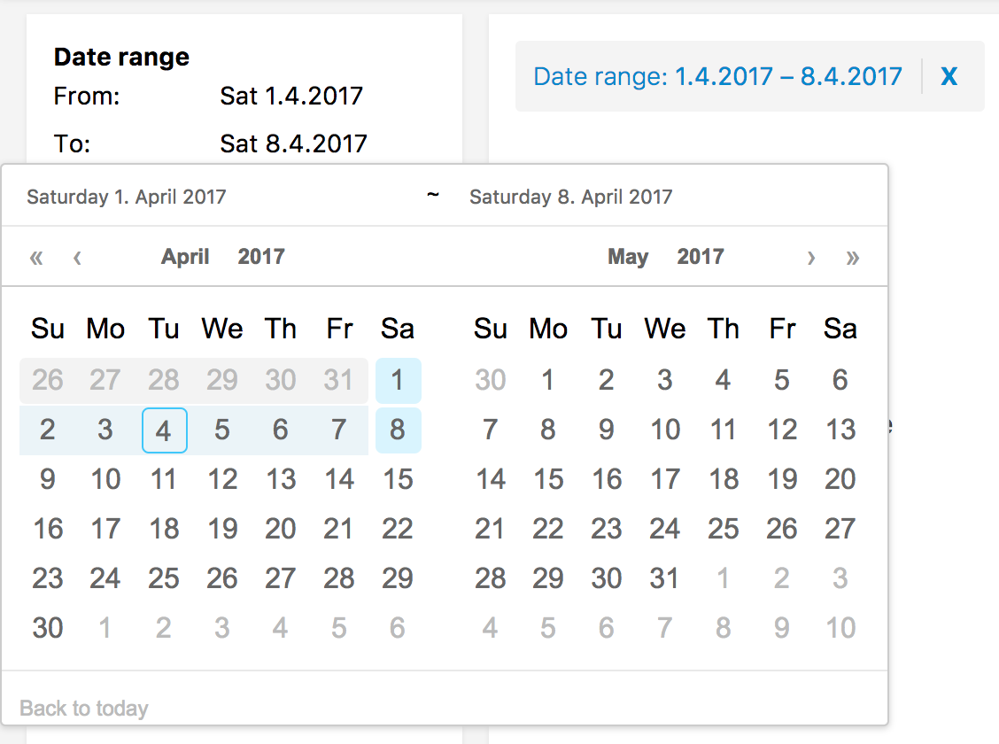

# Date Range Filter
The date range filter lets users filter start-end date ranges based on a start time and an optional end time.

See test app for working example.




## Example

```jsx

import {
  DateRangeFilter,
  DateRangeCalendar,
  SearchkitComponent
} from "searchkit";

class App extends SearchkitComponent {

  render(){
    <div>
     <DateRangeFilter
        id="event_date"
        title="Date range"
        fromDateField="event_date.from"
        toDateField="event_date.to"
        calendarComponent={DateRangeCalendar}
        fieldOptions={{
          type: 'embedded',
          options: {
            path: 'event_date'
          }
        }}
      />
    </div>
  }
}
```

## Props
- `fromDateField` *(ESField)*: Required. An elasticsearch date field to use as the beginning.
- `toDateField` *(ESField)*: Required. An elasticsearch date field to use as the end.
- `id` *(string)*: Required. id of component. Must be unique. Used as key for url serialisation
- `title` *(string)*: Required. Title used for component and for selected filters component
- `calendarComponent` *(ReactComponent)*: Calendar component to use when rendering
   - Compatible with `DateRangeCalendar`
   - Defaults to `DateRangeFilterInput`
- `fieldOptions` *({type:"embedded|nested|children", options:Object})* Configures the type field that is stored in ElasticSearch, can be `embedded` or `nested` or `children`
  - `type:nested` requires `options.path` provided
  - `type:children` requires `options.childType` provided
  - see [Field Options](../../core/FieldOptions.md)
- `rangeFormatter` *((count:number)=> string|number)* A formatter function used to convert numbers into more readable display values. E.g. long number formatting or prefixing currencies.`
