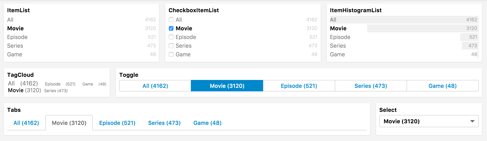

# Menu
Provides a way to navigate through results for a single attribute. Only one value can be selected at a time.

## Example

```jsx

import {
  Pagination,
  Hits,
  SearchkitComponent,
  MenuFilter
} from "searchkit";

class App extends SearchkitComponent {

  render(){
    <div>
      <MenuFilter
        field="languages.raw"
        title="Languages"
        id="languages"/>
    </div>
  }
}
```

## Overriding Filter Option Component
If you want to tweak the markup for a menu option, you can use the `itemComponent` prop and pass in a new react component to be used to render each option.

```jsx

import {
  Pagination,
  Hits,
  SearchkitComponent,
  ItemList
} from "searchkit";

class App extends React.Component {

  render(){
    <div>
      <MenuFilter
        field="languages.raw"
        title="Languages"
        id="languages"
        listComponent={ItemList}/>
    </div>
  }
}
```

## Props
- `field` *(ESAttribute)*: Non-analysed elastic search field to create aggs for the menu
- `title` *(string)*: Title of the menu. Shown as a header and within selected filters
- `id` *(string)*: id of component. Must be unique. Used as key for url serialisation
- `itemComponent` *(ReactComponent)*: Optional. React component which overrides the default filter option component. See `Overriding Filter Option Component` section.
- `listComponent` *(ReactComponent)*: Override the listComponent
  - Compatible with `Select`, `Tabs`, `Toggle`, `TagCloud`, `ItemList`, `CheckboxItemList`, `ItemHistogramList`
  - Defaults to `ItemList`
- `mod` *(string)*: Optional. A custom BEM container class.
- `orderKey` *(string)*: Order key either using an intrinsic sortable key `_count` `_term`
- `orderDirection` *(string)*: `asc` or `desc`
- `include` *(Array<string>|string):* Terms bucket  include parameter see [Terms bucket filtering](https://www.elastic.co/guide/en/elasticsearch/reference/2.x/search-aggregations-bucket-terms-aggregation.html#_filtering_values_2)
- `exclude` *(Array<string>|string):* Terms bucket exclude parameter, see above
- `fieldOptions` *({type:"embedded|nested|children", options:Object})* Configures the type field that is stored in ElasticSearch, can be `embedded`(default) `nested` or `children`
  - `type:nested` requires `options.path` provided
  - `type:children` requires `options.childType` provided
  - see [Field Options](../../core/FieldOptions.md)
- `countFormatter` *((count:number)=> number|string)* A optional function to format the doc counts
- `bucketsTransform` *((buckets:Array)=> transformedBuckets)* A optional function to transform the buckets used for the aggregation, can be used to sort the list or to inject new facets.


## List Component examples



## Translations
- `All` - All

```jsx
<MenuFilter
  field="languages.raw"
  title="Languages"
  id="languages"
  translations={{"All":"All languages"}}/>
```


## Demo
[](codepen://searchkit/YwNwVm?height=800&theme=0)
