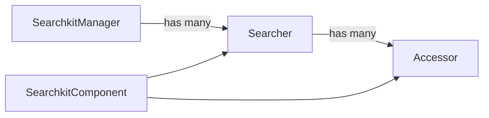

# Searchkit Architecture
ElasticSearch's querying is very sophisticated and modelling relationship between `query`, `components`, `results` and `url` required a certain core architecture.

## Searchkit's core classes

* **[SearchkitManager](SearchkitManager)** us a top level class to manage searchkit
* **Searcher** is responsible for constructing a query from its child accessors + holds the results for dependant components.
>**Note** Most simple applications will need a single **Searcher**, **Searchkit** supports multple for advanced usage to power dashboards, or more complicated apps.
* [**Accessor**](Accessors.md) An accessor manages state, maps to a url key and produces a part of an ElasticSearch query
* [**SearchkitComponent**](SearchkitComponent.md) is the main react baseclass which ties the `Searcher` and  `Accessor` to the UI.
* [**ImmutableQuery**](ImmutableQuery.md) A query object which is passed top down, the query is rebuilt on every search and accessors take care of returning a query based on its state.
>**Note** The query object is immutable as it removes defensive code related to worrying about internal change. It also allows comparison with previous queries when deciding when to search.

