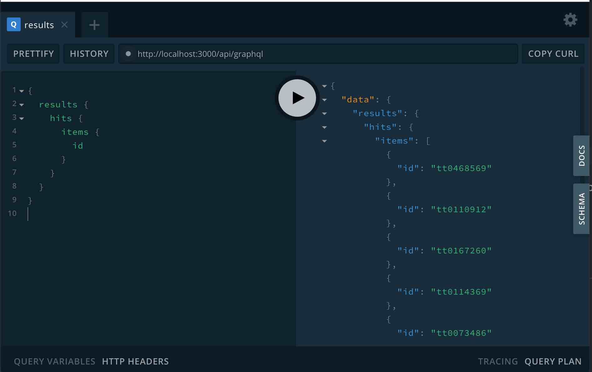

## Setting up Elasticsearch & Indexing

See [Setting up Elasticsearch & Indexing Guide](/docs/core/guides/elasticsearch-setup-indexing) to setup Elasticsearch and index the data corpus to be searched by searchkit.

## Setup Apollo Server

First step is to setup Apollo Server within our app. We are using [Next](https://github.com/vercel/next.js/) & [Apollo Server Micro](https://www.apollographql.com/docs/apollo-server/v1/servers/micro/) where we will use [API routes](https://nextjs.org/docs/api-routes/introduction) for our app.

First install `apollo-server-micro`

`yarn add apollo-server-micro`

then create a `graphql.js` file in the pages/api folder

```javascript
import {ApolloServer, gql} from 'apollo-server-micro';

export const config = {
  api: {
    bodyParser: false,
  },
};

const typeDefs = [
  gql`
    type Query {
      root: String
    }

    type Mutation {
      root: String
    }
  `,
];

const server = new ApolloServer({
  typeDefs,
  resolvers: {},
  introspection: true,
  playground: true,
  context: {},
});

export default server.createHandler({path: '/api/graphql'});
```

Once saved and you have started the app via `yarn start`, you should be able to access the [graphql playground](http://localhost:3000/api/graphql) locally.

#### Dont use Next?

Apollo Docs provides how to [add Apollo Server](https://www.apollographql.com/docs/apollo-server/v1/servers/express/) to any Node based app such as express and AWS Lambda should you wish not to use Next.

## Add Searchkit Schema

Install the NPM module for searchkit

`yarn add @searchkit/schema`

then add searchkit SDL schema and resolvers to graphql server. in this example, we are passing Searchkit's SDL Apollo Server.

```javascript

import { ApolloServer, gql } from 'apollo-server-micro'
import {
  MultiMatchQuery,
  SearchkitSchema
} from '@searchkit/schema'

const searchkitConfig = {
  host: 'http://localhost:9200',
  index: 'my_index',
  connectionOptions: {
    apiKey: "ddfvvvdv", // Optional. Elasticsearch apiKey
    headers: {
      "x-custom-header": "exampleValue" // any custom headers required for the request.
    }
  }
  hits: {
    fields: []
  },
  query: new MultiMatchQuery({ fields: [] }),
  facets: []
}

// Returns SDL + Resolvers for searchkit, based on the Searchkit config
const { typeDefs, withSearchkitResolvers, context } = SearchkitSchema({
  config: searchkitConfig, // searchkit configuration
  typeName: 'ResultSet', // type name for Searchkit Root
  hitTypeName: 'ResultHit', // type name for each search result
  addToQueryType: true // When true, adds a field called results to Query type
})

export const config = {
  api: {
    bodyParser: false
  }
}

const server = new ApolloServer({
  typeDefs: [
    gql`
    type Query {
      root: String
    }

    type HitFields {
      root: String
    }

    # Type name should match the hit typename
    type ResultHit implements SKHit {
      id: ID!
      fields: HitFields
    }
  `, ...typeDefs
  ],
  resolvers: withSearchkitResolvers({}),
  introspection: true,
  playground: true,
  context: {
    ...context
  }
})

export default server.createHandler({ path: '/api/graphql' })

```

Make sure you replace the host, index. This will setup a basic searchkit API and visiting the [API playground](http://localhost:3000/api/graphql), you should be able to do a simple query to make sure its connected to your elasticsearch instance correctly.

```gql
{
  results {
    hits {
      items {
        # 'ResultHit' should match the hitTypename and type you implemented in SDL
        ... on ResultHit {
          id
        }
      }
    }
  }
}
```



## Setup Hit Values

Next you want to configure the fields that come back for each field. For our IMDB search app, we want to show the title, writers, actors, plot and poster for each hit. First locate the `HitFields` type definition and add the fields that you want to display per hit item.

You will need to define the type per field. See [GraphQL types](https://graphql.org/learn/schema/#type-system) to learn more.

```gql
type HitFields {
  title: String
  writers: [String]
  actors: [String]
  plot: String
  poster: String
}
```

Now update your query in [graphql playground](http://localhost:3000/api/graphql) to include these hit fields

```gql
{
  results {
    hits {
      items {
        ... on ResultHit {
          id
          fields {
            title
            writers
            actors
            plot
            poster
          }
        }
      }
    }
  }
}
```

## Configuring Query

Next you want to configure the fields to search on when you provide a text query. To do this, locate the `MultiMatchQuery({ fields: [] })` and pass in the elasticsearch fields that you want to be queried on.

For Searchkit Demo, we want to search the following fields: actors, writers, title and plot. We want title to be the most important field so we will boost its importance by 4. The configuration for this would be

`new MultiMatchQuery({ fields: ['actors', 'writers', 'title^4', 'plot'] })`

Once this has been setup, you should be able to use the query param in the GQL query.

```gql
{
  results(query: "heat") {
    hits {
      items {
        ... on ResultHit {
          id
          fields {
            title
          }
        }
      }
    }
  }
}
```

## Configuring Facets

Next we want to setup facets for our search. Facets are configured within the searchkit configuration.

```javascript
const searchkitConfig = {
  host: 'http://localhost:9200',
  index: 'my_index',
  query: new MultiMatchQuery({fields: []}),
  facets: [
    new RefinementSelectFacet({
      field: 'type.raw',
      identifier: 'type',
      label: 'Type',
    }),
    new RefinementSelectFacet({
      field: 'writers.raw',
      identifier: 'writers',
      label: 'Writers',
    }),
    new RefinementSelectFacet({
      field: 'actors.raw',
      identifier: 'actors',
      label: 'Actors',
    }),
  ],
};
```

### Facets Response

Once configured, API will return all facets values for fields that have aggregations.

```gql
{
  results(query: "heat") {
    facets {
      identifier
      label
      type
      entries {
        label
        count
      }
    }
  }
}
```

See below the response in playground


### Adding Filters

When the user chooses to filter by movies, you can add the filter like so

```gql
{
  results(query: "heat", filters: [{identifier: "type", value: "Movie"}]) {
    facets {
      identifier
      label
      type
      entries {
        label
        count
      }
    }
  }
}
```

Searchkit will query elasticsearch to show only hit + facet results that have a type field value of movie.

## Modify Elasticsearch request body

If you need to modify the request body before sending it to Elasticsearch, eg. to add `min_score`, you can add a `postProcessRequest` function to your schema config.

Every search request will pass through this function, containing the full body, and expecting a full request body back.

```javascript
const searchkitConfig = {
  host: 'http://localhost:9200',
  index: 'my_index',
  hits: {
    fields: [],
  },
  query: new MultiMatchQuery({fields: []}),
  postProcessRequest: (body) => {
    return {...body, min_score: 10};
  },
};
```
