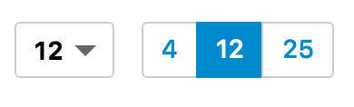

# Page Size Selector
A component which allows to change the results per page of the search results.



`Select` and `Toggle` examples side by side

## Example
```jsx
import {
  Hits,
  PageSizeSelector,
  Select, Toggle  
} from "searchkit";


const App = ()=> (
  <div className="sk-layout__results sk-results-list">
    <div className="sk-results-list__action-bar sk-action-bar">
      <div className="sk-action-bar__info">
        <PageSizeSelector options={[4,12,24]} listComponent={Toggle}/>
      </div>
      <Hits hitsPerPage={12}/>
    </div>
  </div>
)
```

##PageSizeSelector Props
- `options` *(Array<number>)*: Array of page numbers to be shown
- `listComponent` *(ReactComponent)*: Used to customize the list behavior
  - Compatible with `Select`, `Tabs`, `Toggle`, `ItemList`, `CheckboxItemList`
  - Defaults to `Select`
