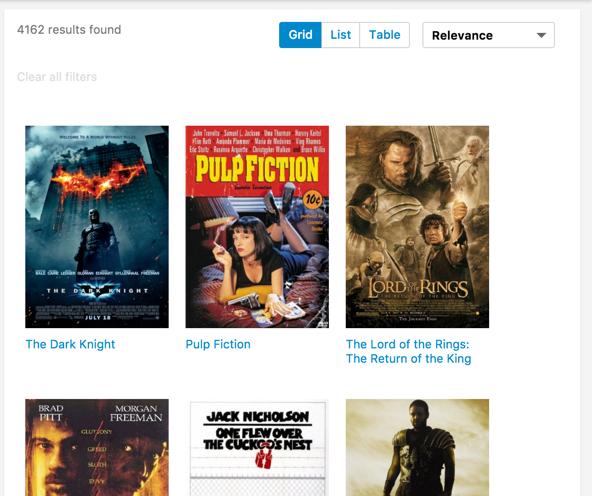

# View Switcher
Searchkit's view switcher components come in 2 seperate components. `ViewSwitcherHits` which toggles the hits display and `ViewSwitcherToggle` which is the actual toggle button to switch views.




## Example
```jsx
import {
  Hits,
  ViewSwitcherHits,
  ViewSwitcherToggle  
} from "searchkit";

const MovieHitsGridItem = (props) => {
  const {result, bemBlocks} = props
  <div className={bemBlocks.item().mix(bemBlocks.container("item"))}>
    
    <div className={bemBlocks.item("title")}>{result._source.title}</div>
  </div>
}
const MovieHitsListItem = (props)=> {
  const {bemBlocks, result} = props  
  const source = result._source
  return (
    <div className={bemBlocks.item().mix(bemBlocks.container("item"))} data-qa="hit">
      <div className={bemBlocks.item("poster")}>
        
      </div>
      <div className={bemBlocks.item("details")}>
        <h2 className={bemBlocks.item("title")}>{source.title}</h2>
        <h3 className={bemBlocks.item("subtitle")}>Released in {source.year}, rated {source.imdbRating}/10</h3>        
      </div>
    </div>
  )

const MovieHitsTable = (props)=> {  
  const { hits } = this.props
  return (
    <div style={{width: '100%', boxSizing: 'border-box', padding: 8}}>
      <table className="sk-table sk-table-striped" style={{width: '100%', boxSizing: 'border-box'}}>
        <thead>
          <tr>
            <th></th> <th>Title</th> <th>Year</th> <th>Rating</th>
          </tr>
        </thead>
        <tbody>
        {map(hits, hit => (
          <tr key={hit._id}>
            <td style={{margin: 0, padding: 0, width: 40}}>
              
            </td>
            <td>{hit._source.title}</td>
            <td>{hit._source.year}</td>
            <td>{hit._source.imdbRating}</td>
          </tr>
          ))}
          </tbody>
      </table>
    </div>
    )  
}


class App extends React.Component {

  render(){
    <div>
      <ViewSwitcherToggle/>
      <ViewSwitcherHits
          hitsPerPage={12}
          sourceFilter={["plot", "title", "poster", "imdbId", "imdbRating", "year"]}
          hitComponents = {[
            {key:"grid", title:"Grid", itemComponent:MovieHitsGridItem, defaultOption:true},
            {key:"list", title:"List", itemComponent:MovieHitsListItem},
            {key:"table", title:"Table", listComponent:MovieHitsTable}
          ]}
          scrollTo="body"
      />
    </div>
  }
}
```

## Configuration
`ViewSwitcherHits` accepts all the props that `Hits` expects with 1 additional `hitComponents` prop.
The `hitComponents` prop is an array of views, with `key`, `title`, `defaultOption` and `itemComponent` or `listComponent`.

```jsx
hitComponents = {[
  {key:"grid", title:"Grid", itemComponent:MovieHitsGridItem, defaultOption:true},
  {key:"list", title:"List", itemComponent:MovieHitsListItem},
  {key:"table", title:"Table", listComponent:MovieHitsTable}
]}
```

##ViewSwitcherHits Props
- `hitComponents` *(Array<{key, title, itemComponent, listComponent, defaultOption?}>)*: React component used for each hit render.
- `hitsPerPage` *(Number)*: Number of results displayed per page
- `highlightFields` *(Array<string>)*: Array of highlighted fields. Any highlight matches will be returned in the result.highlight[fieldName]. See above for example.
- `mod` *(string)*: Optional. A custom BEM container class.
- `sourceFilter` *(string|boolean|Array<string>)*: A source filter parameter which is sent to elasticsearch to reduce the hit `_source` data within the results. see the [elastic documentation](https://www.elastic.co/guide/en/elasticsearch/reference/current/search-request-source-filtering.html) for further details.
- `scrollTo` *(string|boolean)*: When results have changed, we scroll to the top of the element using the jQuery style selector passed in the `scrollTo` prop. If true, it will use the body as the selector.  Default value is true. If false, it will not scroll when new results are rendered. We determine a change by comparing hits `_id` field with the new results.

##ViewSwitcherToggle Props
- `listComponent` *(ReactComponent)*: Used to customize the list behavior
  - defaults to `Toggle`, compatible with `Toggle`, `Select`, `Tabs`
